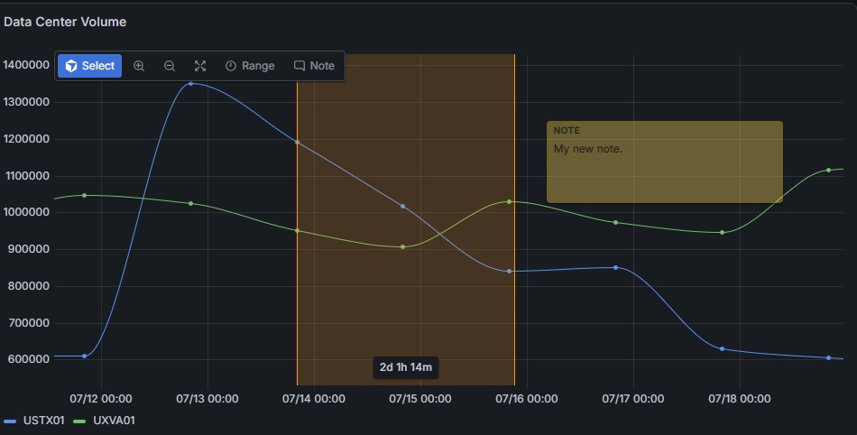
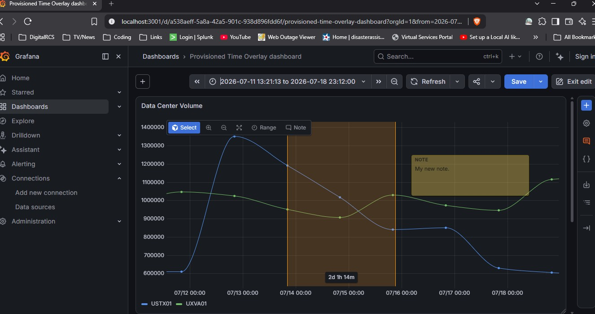

# DigitalRCS-TimeOverlay-Panel for Grafana

[DigitalRCS-TimeOverlay-Panel](https://www.digitalrcs.com) is a Grafana panel plugin for placing persistent, printable measurements and notes directly over time-series data.

It is installed as a separate **DigitalRCS-TimeOverlay-Panel** visualization. Users can choose it from Grafana's visualization picker without replacing or modifying the built-in **Time series** visualization.


Developed by [DigitalRCS](https://www.digitalrcs.com).

## Screenshots

### Time overlay panel



### Grafana dashboard



The screenshots use infrastructure measurements as one example. The panel accepts any compatible time-series data and does not contain domain-specific logic.

## Documentation

- [GitHub Wiki](https://github.com/digitalrcs/DigitalRCS-TimeOverlay-Panel/wiki)
- [User guide](docs/wiki/User-Guide.md)
- [Data sources and queries](docs/wiki/Data-Sources.md)
- [Panel configuration](docs/wiki/Panel-Configuration.md)
- [Deployment guide](docs/DEPLOYMENT.md)
- [Plugin signing guide](docs/PLUGIN-SIGNING.md)
- [Developer guide](docs/wiki/Developer-Guide.md)
- [Troubleshooting](docs/wiki/Troubleshooting.md)

## Features

- Use Grafana-style drag-to-zoom, tooltips, axes, and legends on the native time-series renderer.
- Show configurable point markers and hover them to see the timestamp and every series value.
- Choose straight or smooth curved lines between data points.
- Zoom in or out by 50% with toolbar buttons, or select an exact zoom area by dragging.
- Restore the original dashboard range with **Zoom all**; zoom-out is capped at that range.
- Draw a time range by selecting **Range** and dragging across the plot.
- Display the selected duration in a box on the range.
- Select and drag a range, or resize it from either edge.
- Add editable notes with a translucent background.
- Drag notes by their header and resize them from the lower-right corner.
- Save overlays in the dashboard's panel options so they survive reloads and appear in Grafana PNG/PDF rendering.
- Detect `time`/`_time` fields and render every numeric data field as a dynamically named series.
- Convert common CSV string values and Splunk epoch timestamps into Grafana time-series fields when needed.

### Datasource compatibility

The panel does not connect to or contain query logic for any specific datasource. It consumes the
standard Grafana data frames supplied to panel plugins, just like Grafana's built-in time-series
visualization. Any datasource can be used when its query returns at least one field typed as
**Time** and one or more fields typed as **Number**. Typed frames, including their field names,
labels, units, links, metadata, and overrides, are passed through unchanged. Multiple query frames
are supported.

The `time`/`_time` recognition and numeric-string conversion are compatibility fallbacks for
untyped table results; they are not tied to CSV or Splunk. When a datasource returns another
shape, use its query editor or Grafana transformations such as **Convert field type**, exactly as
you would for the built-in Time series panel.

- Give dynamically discovered series distinct palette colors, or assign fixed colors to individual fields with Grafana field overrides.
- Adjust note and highlighted-range background opacity independently from their colors.

## Development

Run the supported toolchain from WSL:

```bash
cd /mnt/c/Data/GrafanaCode/digitalrcs-timeoverlay-panel
npm install
npm run dev
```

In a second WSL terminal:

```bash
cd /mnt/c/Data/GrafanaCode/digitalrcs-timeoverlay-panel
docker compose up
```

Open <http://localhost:3001> and sign in with `admin` / `admin` unless you set a
different development password. The example dashboard is imported into
Grafana's database so it remains editable in the UI; the sample data source is
provisioned separately. The host directory `.local/grafana-data` preserves saved
dashboards and login changes across container recreation.

To use an explicit Docker administrator password in PowerShell:

```powershell
$env:GRAFANA_ADMIN_PASSWORD = Read-Host -AsSecureString | ConvertFrom-SecureString -AsPlainText
docker compose up
```

If Windows Grafana already uses port 3000, select another Docker port:

```powershell
$env:GRAFANA_PORT = '3002'
docker compose up
```

Use the same environment value on later starts if the Compose project needs to
import the example dashboard. Do not put the password in the repository.

For an existing Windows Grafana installation, import the example as an ordinary
editable dashboard with:

```powershell
.\scripts\import-dashboard.ps1 -GrafanaUrl http://localhost:3001
```

The script prompts securely for Grafana credentials. If a dashboard with the
same UID is currently file-provisioned, remove that dashboard from its
provisioning source, restart Grafana, and then run the import.

Run the validation suite before packaging changes:

```bash
npm run typecheck
npm run lint
npm run test:ci
npm run build
```

### Use a Splunk CSV export locally

The development stack installs the signed Grafana CSV data-source plugin and
provisions a sample CSV datasource. The included sample happens to use
infrastructure series, but the panel is designed for generic time-series data.
To replace the sample with another export containing
`_time` (or `time`) followed by one or more numeric measurement columns, run:

```powershell
.\scripts\prepare-csv.ps1 -InputPath C:\path\to\datasource.csv
docker compose restart grafana
```

The converter validates all rows and changes Splunk offsets such as `-0400`
to the RFC-3339 form `-04:00` required by the CSV parser. Timestamps without an
offset, such as `2026-08-01 20:00:00`, are interpreted in
`America/New_York` by default. Use `-TimeZoneId` to select another source time
zone. Series names are not hard-coded: headers such as `temperature`,
`request_count`, `latency_ms`, or any other measurement name are preserved, and
integer or decimal values are accepted. Spaces around column names and values
are accepted. The original export is not modified.

### Configure a new CSV query

Selecting a CSV datasource does not, by itself, define which fields that
datasource should return. In the CSV query editor:

1. Under **Fields**, name the time field exactly as it appears in the file (`time` or `_time`) and set its type to **Time**.
2. Leave **Ignore unknown** turned off so changing measurement columns are returned too.
3. You may add each measurement field as **Number**, but it is not required for this panel. Numeric-looking string fields are detected automatically.
4. Set **Timezone** to the source timezone when timestamps do not contain an offset.

Splunk and other datasources normally return typed fields directly. The panel
uses any existing Grafana time field and plots every numeric field, so a query
can return different series names without changing the panel.

## Using overlays

1. Add a panel and choose **DigitalRCS-TimeOverlay-Panel** from Grafana's visualization picker.
2. Use **Zoom in** or **Zoom out** for a 50% step. **Zoom out** stops at the original range, and **Zoom all** restores that range immediately.
3. In **Select** mode, drag horizontally across empty plot space to zoom to an exact interval. Shift-drag also supports vertical-axis zoom.
4. Select **Range**, then press and drag horizontally across the graph to create a printable duration overlay.
5. Select an existing range to move it or expose its two resize handles.
6. Select **Note** to add a note. Type directly in it, drag its **Note** header, or resize its lower-right corner.
7. Select an overlay and use the trash button to delete it.
8. Save the dashboard before exporting or leaving the page.

### Set a color for an individual series

1. Edit the panel and open **Overrides**.
2. Select **Add field override**, then **Fields with name** and choose any returned series.
3. Add the **Color** property and choose **Fixed color**.

The default **Classic palette** gives the returned series distinct colors.
Overrides let you enforce stable, organization-specific colors for particular
series names without using thresholds. The note and range opacity sliders
are under the panel's standard options.

Grafana's server-side image renderer captures the saved panel state. The edit toolbar is automatically hidden on `/render` routes. PDF export requires Grafana Enterprise; PNG export requires the Grafana image renderer service.

## Deployment

See [Deployment](docs/DEPLOYMENT.md) for detailed instructions covering:

- Installing a prebuilt GitHub Release ZIP without Node.js, npm, or compilation
- Installing signed releases or explicitly approved unsigned packages
- Windows service installations
- Linux and virtual-machine installations
- Docker and Docker Compose
- Kubernetes and Helm-oriented deployments
- Signed private production plugins
- Private and public Grafana plugin-signing routes

Do not commit Grafana access-policy tokens, administrator passwords, internal URLs, or private certificates. Store deployment secrets in the target organization's approved secret manager or CI secret store.

## Compatibility

- Grafana `12.3.0` or later
- Frontend-only panel plugin; no platform-specific backend binary is required
- A time field and at least one numeric field in the returned data frame
